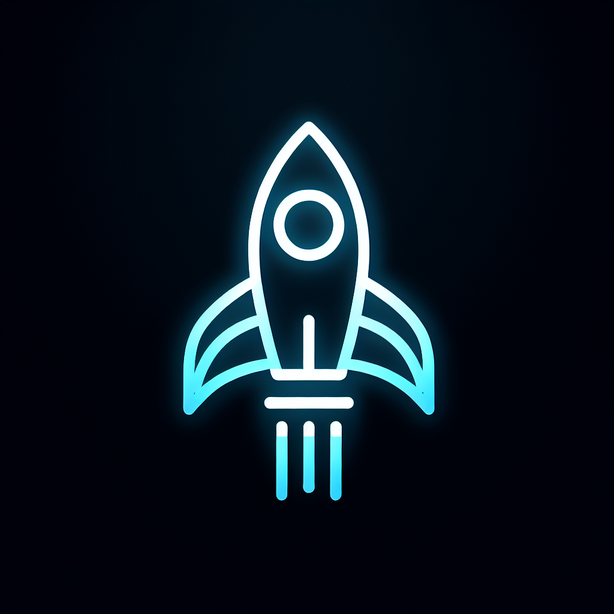

# Orbital Nexus - Space MMO Server



A sophisticated UDP-based game server for a Space MMO featuring advanced orbital mechanics simulation, dynamic NPC interactions, and immersive 3D solar system visualization.

## Overview

Orbital Nexus is a lightweight, high-performance server designed to support massively multiplayer space games with realistic orbital mechanics and sophisticated AI behaviors. Built to handle up to 2000 concurrent players, the server employs area of interest management for efficient state replication across solar-system-scale environments.

### Key Features

- **Advanced Orbital Mechanics**: Accurate simulation of celestial bodies with proper Keplerian orbits
- **Area of Interest Management**: Efficient state replication for solar-system scale environments
- **Dynamic NPC System**: Sophisticated NPC ships with variable behaviors and AI states
- **Mission Generation System**: Procedurally generated missions with fleet assignments
- **Ship Template System**: Customizable ship templates with specialized parameters for different ship types
- **Web-based Admin Dashboard**: Complete control and monitoring of the game world
- **Sophisticated UDP Networking**: Low-latency binary protocol optimized for real-time gameplay
- **JSON-based Persistence**: Simple file-based storage for server state

## Architecture

The server architecture is designed around a few core principles:

1. **Lightweight Core**: The server core is extremely lightweight to minimize resource usage while supporting thousands of concurrent clients
2. **State Replication**: Server validates and replicates client-driven state changes
3. **Area of Interest**: Entities are only synchronized to clients when in relevant areas of interest
4. **Fixed Tick Rate**: Server runs at 20 ticks per second (50ms interval) for consistent simulation
5. **Separation of Systems**: Independent systems for celestial simulation, NPC management, mission management, etc.

### Component Overview

- **UDP Server**: Low-level networking for client communications
- **Game State Manager**: Core game state tracking and validation
- **AOI Manager**: Area of Interest management for efficient replication
- **Celestial Manager**: Simulates and manages celestial bodies
- **NPC Manager**: Controls AI-driven NPCs throughout the system
- **Mission Manager**: Generates and manages missions
- **Sanity Check Manager**: Validates game state integrity

## Tech Stack

- **Backend**: TypeScript/Node.js with Express
- **Networking**: Custom UDP implementation
- **Frontend Dashboard**: React with shadcn/ui components
- **3D Visualization**: Three.js for web-based solar system visualization
- **State Management**: React Query for frontend state management
- **Data Schema**: Shared TypeScript types between client and server

## Installation and Setup

### Prerequisites

- Node.js (v18+)
- npm or yarn

### Installation

1. Clone the repository:
```bash
git clone https://github.com/yourusername/orbital-nexus.git
cd orbital-nexus
```

2. Install dependencies:
```bash
npm install
```

3. Start the development server:
```bash
npm run dev
```

4. Access the admin dashboard at http://localhost:5000

## Configuration

### Server Settings

The server's configuration can be adjusted through the admin dashboard under "Server Settings":

- **Simulation Speed**: Adjust the simulation rate of celestial bodies
- **Auto-save Interval**: Control how frequently the server state is persisted
- **Area of Interest Size**: Configure the size of AOI regions
- **NPC Density**: Adjust the number of NPCs in the system

### Ship Templates

Custom ship templates can be created and modified through the Ship Editor interface:

1. Navigate to "Ship Editor" in the dashboard
2. Create templates for each ship type (combat, transport, civilian, mining)
3. Configure basic parameters (mass, speed, etc.)
4. Use the "Advanced Tuning" tab for specialized ship-type-specific settings

## API Documentation

The server exposes a RESTful API for dashboard operations and a UDP protocol for game clients.

### REST API Endpoints

- **GET /api/status**: Server status information
- **GET /api/celestial**: Celestial body data
- **GET /api/npc/fleets**: NPC fleet information
- **GET /api/missions**: Active missions data
- **GET /api/ship-templates**: Available ship templates
- **POST /api/world/reset**: Reset the game world
- **POST /api/world/save**: Force-save the game world

Check the "API Docs" page in the dashboard for a complete list of endpoints.

### UDP Protocol

The UDP protocol is binary-based for efficiency. Client implementations should use the following message types:

- **ClientConnect**: Establish connection to server
- **ClientDisconnect**: Gracefully disconnect from server
- **ClientStateUpdate**: Send client state updates
- **ServerStateUpdate**: Receive state updates from server
- **ServerEvent**: Receive event notifications

## Development

### Project Structure

```
├── client/ - Admin dashboard frontend
│   └── src/
│       ├── components/ - React components
│       ├── contexts/ - React contexts
│       ├── hooks/ - Custom React hooks
│       ├── lib/ - Utility functions
│       └── pages/ - Dashboard pages
├── server/ - Backend server code
│   ├── aoi.ts - Area of Interest management
│   ├── celestial.ts - Celestial body simulation
│   ├── index.ts - Server entry point
│   ├── mission.ts - Mission system
│   ├── npc.ts - NPC management
│   ├── routes.ts - HTTP API endpoints
│   ├── state.ts - Game state management
│   └── storage.ts - Data persistence
└── shared/ - Shared code between client and server
    ├── math.ts - Math utilities
    ├── physics.ts - Physics calculations
    ├── schema.ts - Data schemas
    └── types.ts - TypeScript type definitions
```

### NPC System

The NPC system supports multiple ship types and AI states:

- **Ship Types**: enemy, transport, civilian, mining
- **AI States**: idle, patrolling, attacking, fleeing, mining, docking, trading, escorting
- **Navigation States**: none, pathfinding, waypoint, formation, mission
- **Avoidance States**: none, active, recovering

NPCs can navigate using waypoints, formations, and obstacle avoidance systems.

### Celestial Simulation

The celestial simulation accurately models:

- Planets with proper orbits
- Moons orbiting planets
- Asteroids and space stations
- Custom celestial bodies

You can toggle "frozen mode" to pause celestial motion when needed.

## Contributing

Contributions are welcome! Please feel free to submit a Pull Request.

1. Fork the repository
2. Create your feature branch (`git checkout -b feature/amazing-feature`)
3. Commit your changes (`git commit -m 'Add some amazing feature'`)
4. Push to the branch (`git push origin feature/amazing-feature`)
5. Open a Pull Request

## License

This project is licensed under the MIT License - see the LICENSE file for details.

## Acknowledgments

- Orbital mechanics calculations based on [Fundamentals of Astrodynamics](https://en.wikipedia.org/wiki/Fundamentals_of_Astrodynamics)
- UDP networking inspired by [Fast-Paced Multiplayer](https://gabrielgambetta.com/client-server-game-architecture.html)
- Area of Interest concept based on academic papers on MMOG state synchronization